# Student Management System

## Security and Architecture

This project uses a React/Vite frontend, Django REST Framework API, Django ORM, and SQLite database:

User -> React Frontend -> REST API -> Django REST Framework -> Django ORM -> SQLite

The first-time setup creates the institution profile and an administrator account. Passwords are hashed by Django and private student, department, dashboard, and settings APIs require a DRF token. The frontend stores only the authentication token and redirects expired sessions to `/login`.

Key routes include `/setup`, `/login`, `/`, `/students`, `/students/add`, `/students/edit/:id`, `/departments`, and `/settings`. Student CRUD validates identity, department, phone, gender, academic fields, status, and backlog count on both client and server. Dashboard counts and department summaries are calculated from API/database records.

A college-level full-stack **CRUD (Create, Read, Update, Delete) Web Application** designed for managing student records. Built using a decoupled architecture with **Django REST Framework** powering the backend API, **React (Vite)** on the frontend, and **SQLite** as the database.

---

## 1. Project Overview

The **Student Management System** is a responsive web application that streamlines the recording, retrieval, modification, and deletion of college student profiles. It demonstrates core software engineering principles including RESTful API design, database constraints, double-layer validation (client & server), dynamic search filtering, responsive UI design, and automated testing readiness.

---

## 2. Problem Statement

Educational institutions handle large volumes of student records spanning multiple departments and academic years. Manual tracking or disparate spreadsheet logs frequently lead to duplicate entries, invalid contact details, and slow lookups. This system provides a centralized, validated, and interactive dashboard to manage student records efficiently without data duplication or manual errors.

---

## 3. Objectives

- Implement complete **CRUD operations** via RESTful architecture.
- Ensure strict **client-side and server-side data validation**.
- Enforce database integrity with unique constraints and format regex.
- Provide a clean, modern, and **responsive user experience** across mobile, tablet, and desktop devices.
- Deliver clear **API documentation** and **Postman test suites** for viva and project evaluation.

---

## 4. Key Features

- **Add Student**: Intuitive form to register new students with instant client-side validation.
- **View Students**: Clean, responsive table displaying all enrolled student records directly from SQLite.
- **Edit Student**: Seamless inline editing mode that pre-populates the form with existing student details.
- **Delete Student with Confirmation**: Safe deletion workflow featuring an accessible confirmation modal.
- **Dynamic Search / Filter**: Real-time client-side search filtering by student name, roll/register number, department, or email.
- **Client & Server Validation**: Double-layer validation preventing empty fields, duplicate roll numbers/emails, invalid years, or non-10-digit phone numbers.
- **REST API**: Standardized JSON endpoints adhering to HTTP status codes (`200`, `201`, `204`, `400`, `404`, `500`).
- **Connection Health & Loading States**: Clear user feedback for loading, empty states, and server unreachable alerts.

---

## 5. Application Screenshots

Captured from the running application (React frontend + Django REST API + SQLite). Full-resolution images live in [`screenshots/`](screenshots/).

| | |
| :--- | :--- |
| 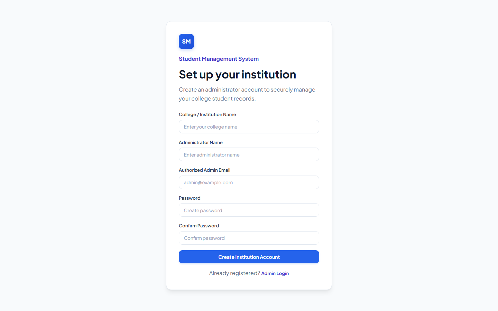<br><sub><b>First-Run Setup</b> — create the institution profile and the administrator account.</sub> | 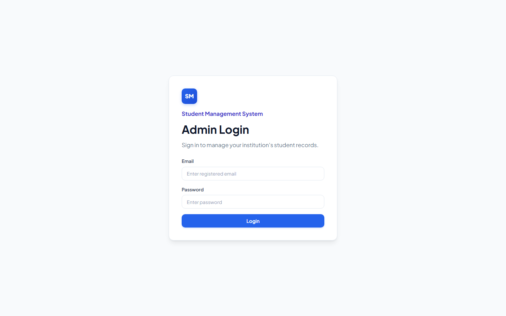<br><sub><b>Admin Login</b> — token-based sign-in with the registered admin email.</sub> |
| 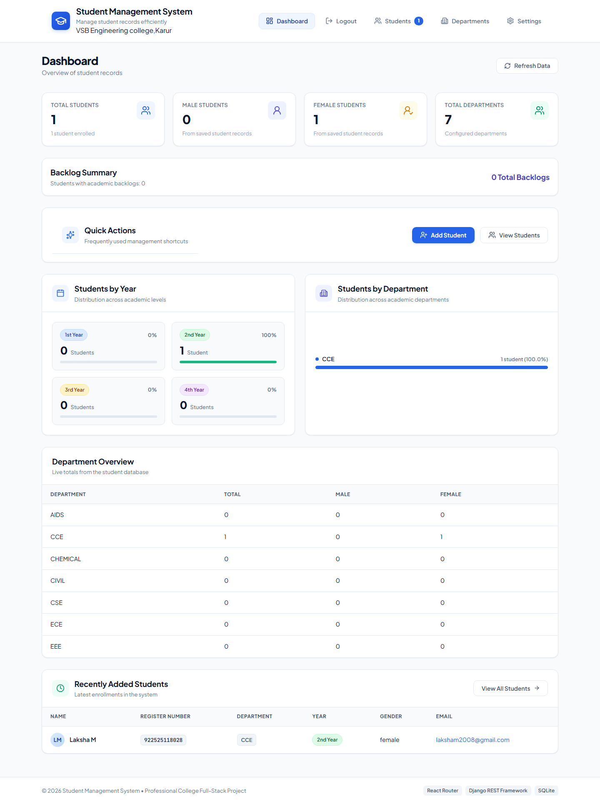<br><sub><b>Dashboard</b> — live totals, backlog summary, students by year and by department, and recently added students.</sub> | 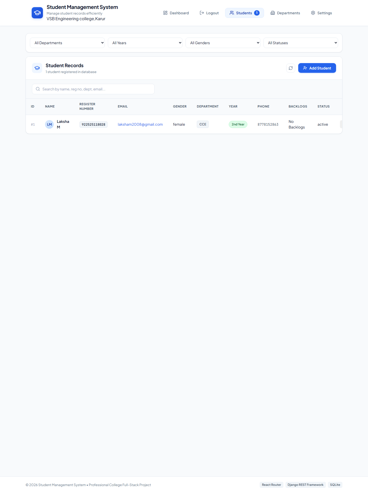<br><sub><b>Student Records</b> — searchable, filterable table (department, year, gender, status) served from SQLite.</sub> |
| 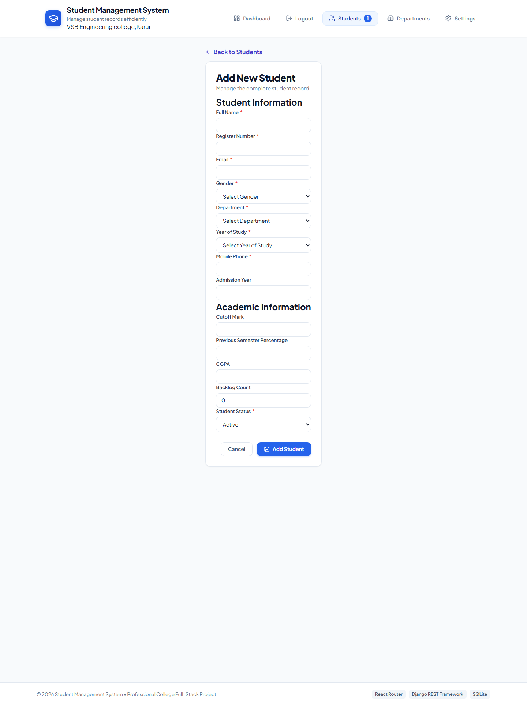<br><sub><b>Add Student</b> — validated form covering identity, contact, and academic fields.</sub> | 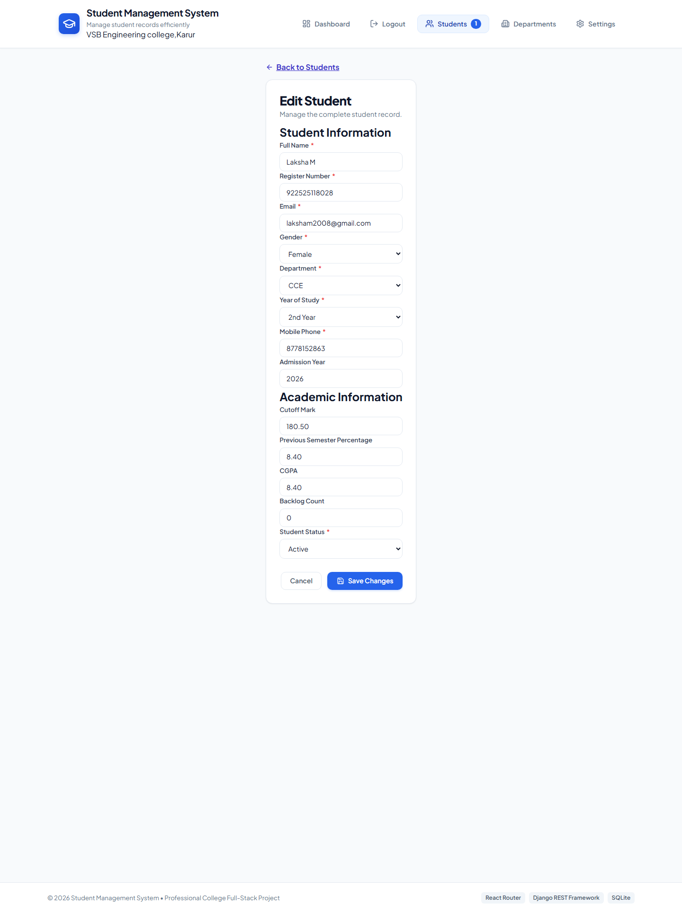<br><sub><b>Edit Student</b> — the same form pre-populated with an existing record.</sub> |
| 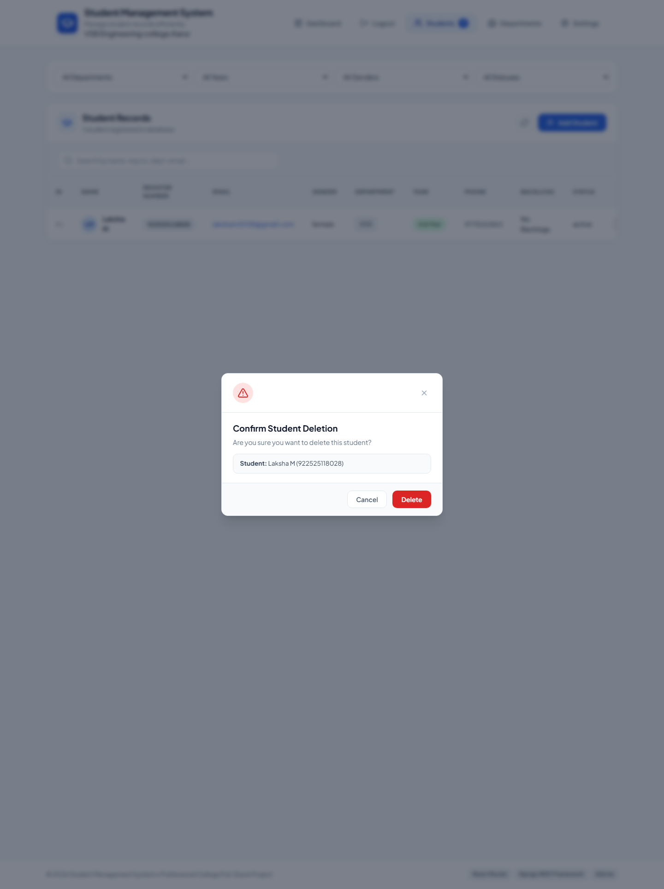<br><sub><b>Delete Confirmation</b> — accessible modal naming the exact record before deletion.</sub> | 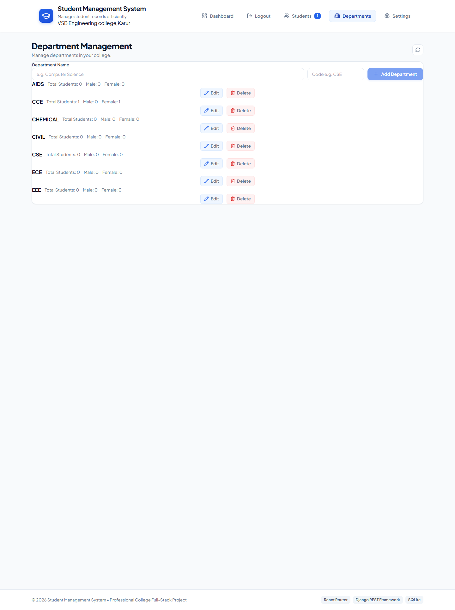<br><sub><b>Department Management</b> — add, edit, and delete departments with live student counts.</sub> |
| 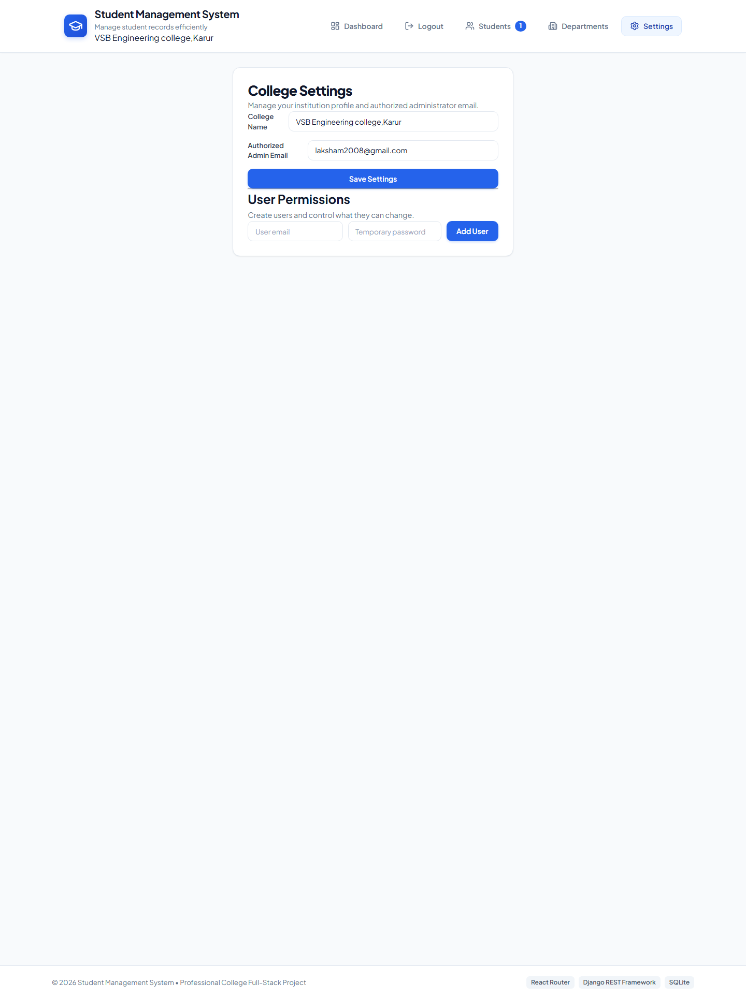<br><sub><b>College Settings</b> — institution profile, authorized admin email, and user permissions.</sub> | 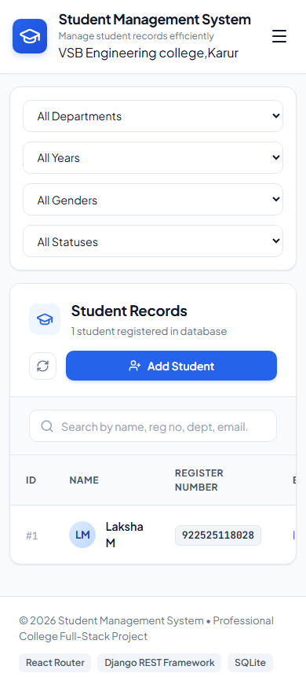<br><sub><b>Responsive Design</b> — the student records page on a mobile viewport.</sub> |

---

## 6. Technology Stack

| Layer | Technology | Details |
| :--- | :--- | :--- |
| **Frontend** | React 19 + Vite | JavaScript, JSX, Vanilla CSS, Lucide Icons |
| **Backend** | Python 3.14 + Django 5.2 | Django REST Framework (DRF), `django-cors-headers` |
| **Database** | SQLite3 | Default lightweight relational database (`db.sqlite3`) |
| **API Protocol** | REST API | JSON over HTTP (`Fetch API`) |
| **API Testing** | Postman & Django TestCase | Automated unit tests and collection |
| **Version Control** | Git & GitHub | Modular commit history |

---

## 7. System Architecture

```
User (Browser)
      │
      ▼
React Frontend (Vite)  ──[ HTTP / JSON Requests ]──►  Django REST Framework
      │                                                        │
      │                                                        ▼
      │                                                Django ORM (Models)
      │                                                        │
      ▼                                                        ▼
Rendered UI Components ◄──[ JSON API Responses ]──────  SQLite Database (db.sqlite3)
```

---

## 8. Database Schema (ER Diagram)

The diagram below was generated from the live schema of `backend/db.sqlite3` (column names and types verified with `PRAGMA table_info`). It covers the six application tables — `auth_user`, `authtoken_token`, `college_collegesettings`, `college_department`, `college_useraccess`, and `students_student` — and their seven foreign-key relationships.

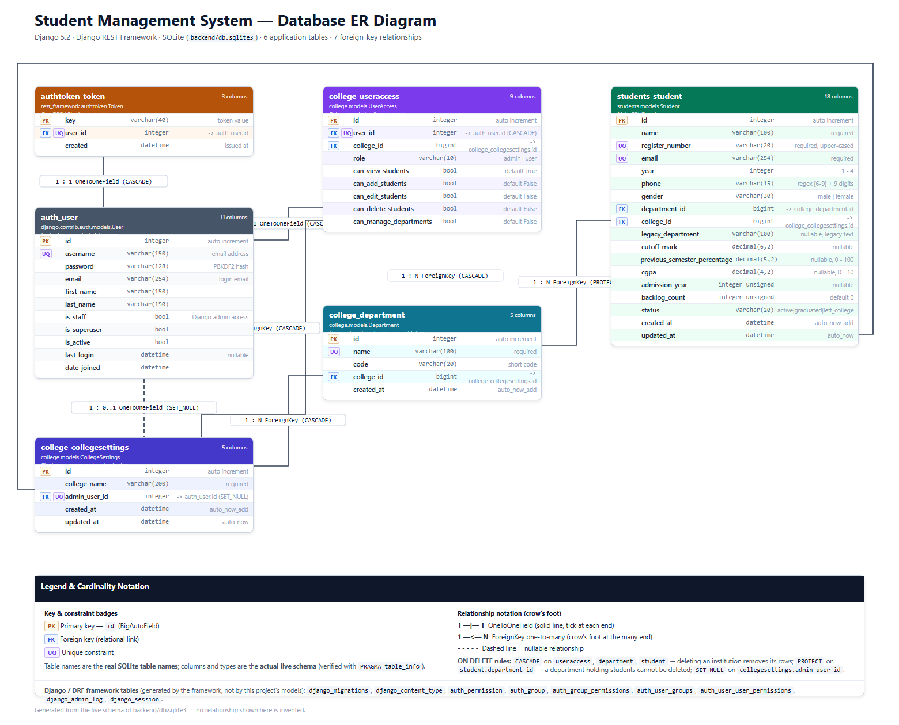

**Key relationships & delete rules**

- `auth_user` ↔ `authtoken_token`: 1 : 1 (`OneToOneField`, `CASCADE`) — one DRF token per user, deleted with the user.
- `auth_user` → `college_useraccess`: 1 : 1 (`CASCADE`) — role plus `can_*` permission flags per user.
- `auth_user` → `college_collegesettings.admin_user_id`: `SET_NULL` — the institution profile survives admin deletion.
- `college_collegesettings` → `college_useraccess` / `college_department` / `students_student`: 1 : N (`CASCADE`) — every record is scoped to one institution.
- `college_department` → `students_student.department_id`: `PROTECT` — a department holding students cannot be deleted.

Django/DRF framework tables (`django_migrations`, `django_content_type`, `auth_permission`, `auth_group`, `django_session`, …) are omitted for clarity.

---

## 9. Project Structure

```
Student-Management-CRUD/
├── backend/
│   ├── config/
│   │   ├── __init__.py
│   │   ├── asgi.py
│   │   ├── settings.py          # CORS, DRF, Apps configuration
│   │   ├── urls.py              # Main URL router
│   │   └── wsgi.py
│   ├── college/
│   │   ├── migrations/          # College app migrations
│   │   ├── __init__.py
│   │   ├── admin.py             # Django Admin registration
│   │   ├── apps.py
│   │   ├── models.py            # CollegeSettings, Department & UserAccess models
│   │   ├── permissions.py       # Token auth + role / permission enforcement
│   │   ├── serializers.py       # Setup, settings, department & user serializers
│   │   ├── tests.py             # Automated API unit tests
│   │   ├── urls.py              # Setup, login, users, settings & department routes
│   │   └── views.py             # Auth, dashboard, settings & department views
│   ├── students/
│   │   ├── migrations/          # Student app migrations (0001 – 0006)
│   │   ├── __init__.py
│   │   ├── admin.py             # Django Admin registration
│   │   ├── apps.py
│   │   ├── exceptions.py        # Custom API exception handler
│   │   ├── models.py            # Student model & DB constraints
│   │   ├── serializers.py       # DRF StudentSerializer & validation
│   │   ├── tests.py             # Automated API unit tests
│   │   ├── urls.py              # Student API endpoints
│   │   └── views.py             # StudentViewSet CRUD handlers
│   ├── db.sqlite3               # SQLite database file
│   ├── manage.py
│   ├── requirements.txt         # Python dependencies
│   └── run-backend.bat          # Windows helper: start the API server
│
├── frontend/
│   ├── public/
│   │   ├── favicon.svg
│   │   └── icons.svg
│   ├── src/
│   │   ├── assets/                  # Static images used by the UI
│   │   ├── components/
│   │   │   ├── ConfirmDialog.jsx    # Delete confirmation modal
│   │   │   ├── DashboardCards.jsx   # Dashboard stat cards
│   │   │   ├── DepartmentChart.jsx  # Students-by-department distribution
│   │   │   ├── Header.jsx           # Top navigation & branding
│   │   │   ├── QuickActions.jsx     # Dashboard shortcut panel
│   │   │   ├── RecentStudents.jsx   # Latest enrollments table
│   │   │   ├── SearchBar.jsx        # Live search bar component
│   │   │   ├── StudentForm.jsx      # Add/Edit form with validation
│   │   │   ├── StudentList.jsx      # Filters + records container
│   │   │   ├── StudentTable.jsx     # Responsive student records table
│   │   │   ├── Toast.jsx            # Notification alert popup
│   │   │   └── YearStats.jsx        # Students-by-year statistics
│   │   ├── pages/
│   │   │   ├── AuthPages.jsx        # First-run setup & login screens
│   │   │   ├── Dashboard.jsx        # Overview dashboard
│   │   │   ├── Departments.jsx      # Department management
│   │   │   ├── Settings.jsx         # College settings & user permissions
│   │   │   ├── StudentEditor.jsx    # Add / Edit student pages
│   │   │   └── Students.jsx         # Student records page
│   │   ├── services/
│   │   │   └── api.js               # Centralized API service client
│   │   ├── App.jsx                  # Routes & application state
│   │   ├── App.css                  # Component & dashboard styling
│   │   ├── index.css                # Design tokens, variables, typography
│   │   └── main.jsx
│   ├── .env.example
│   ├── index.html
│   ├── package.json
│   ├── vite.config.js
│   └── run-frontend.bat             # Windows helper: start the Vite dev server
│
├── documentation/
│   ├── API_DOCUMENTATION.md                             # Detailed API specification & test matrix
│   ├── DATABASE_ER_DIAGRAM.png                          # ER diagram generated from the live schema
│   └── Student_Management_API.postman_collection.json   # Ready-to-import Postman collection
│
├── screenshots/                 # Application walkthrough images (embedded in this README)
│
├── start-dev.bat                # Windows helper: run backend + frontend together
├── .gitignore
└── README.md
```

---

## 10. Prerequisites

Ensure you have the following installed on your system:
- **Python**: Version 3.10+ (Tested on Python 3.14)
- **Node.js**: Version 18+ (Tested on Node.js 24)
- **Git**
- **Postman** (for API testing)

---

## 11. Backend Setup Instructions

1. **Navigate to backend directory**:
   ```bash
   cd backend
   ```

2. **Create and activate a Python virtual environment** (recommended):
   - **Windows (Command Prompt / PowerShell)**:
     ```bash
     python -m venv venv
     venv\Scripts\activate
     ```
   - **macOS / Linux**:
     ```bash
     python3 -m venv venv
     source venv/bin/activate
     ```

3. **Install Python dependencies**:
   ```bash
   pip install -r requirements.txt
   ```

4. **Apply database migrations**:
   ```bash
   python manage.py makemigrations
   python manage.py migrate
   ```

5. **Run backend automated tests** (optional verification):
   ```bash
   python manage.py test students
   ```

6. **Start the Django development server**:
   ```bash
   python manage.py runserver
   ```
   The backend API will run at `http://127.0.0.1:8000/api/students/`.

---

## 12. Frontend Setup Instructions

1. **Open a new terminal and navigate to frontend directory**:
   ```bash
   cd frontend
   ```

2. **Install Node dependencies**:
   ```bash
   npm install
   ```

3. **Start the React Vite development server**:
   ```bash
   npm run dev
   ```
   The application dashboard will be available at `http://localhost:5173/` or `http://127.0.0.1:5173/`.

---

## 13. REST API Endpoints

All endpoints below require the header `Authorization: Token <token>` except `GET/POST /api/setup/` and `POST /api/login/`, which are public.

### Students

| HTTP Method | Endpoint | Description | Status Code |
| :--- | :--- | :--- | :--- |
| `GET` | `/api/students/` | Retrieve all student records | `200 OK` |
| `GET` | `/api/students/?search=<query>` | Filter students by name, reg no, department, email | `200 OK` |
| `GET` | `/api/students/?department=<id>&year=<n>&gender=<v>&status=<v>` | Filter by department, year, gender or status | `200 OK` |
| `GET` | `/api/students/{id}/` | Retrieve single student by ID | `200 OK` / `404 Not Found` |
| `POST` | `/api/students/` | Create a new student record | `201 Created` / `400 Bad Request` |
| `PUT` | `/api/students/{id}/` | Full update of student record | `200 OK` / `400 Bad Request` / `404` |
| `PATCH` | `/api/students/{id}/` | Partial update of student fields | `200 OK` / `400 Bad Request` / `404` |
| `DELETE` | `/api/students/{id}/` | Delete a student record | `204 No Content` / `404 Not Found` |

> `department` is the **numeric primary key** of a department (from `GET /api/departments/`), not the department name.

### Departments

| HTTP Method | Endpoint | Description | Status Code |
| :--- | :--- | :--- | :--- |
| `GET` | `/api/departments/` | List departments with student counts | `200 OK` |
| `GET` | `/api/departments/{id}/` | Retrieve a single department | `200 OK` / `404 Not Found` |
| `POST` | `/api/departments/` | Create a department | `201 Created` / `400 Bad Request` |
| `PUT` | `/api/departments/{id}/` | Full update of a department | `200 OK` / `400 Bad Request` / `404` |
| `PATCH` | `/api/departments/{id}/` | Partial update of a department | `200 OK` / `400 Bad Request` / `404` |
| `DELETE` | `/api/departments/{id}/` | Delete a department (only when no students are assigned) | `200 OK` / `400 Bad Request` |

### Authentication, users and settings

| HTTP Method | Endpoint | Description | Status Code |
| :--- | :--- | :--- | :--- |
| `GET` | `/api/setup/` | Institution setup status (`configured: true/false`) | `200 OK` (public) |
| `POST` | `/api/setup/` | First-run institution + administrator creation, returns a token | `201 Created` / `400` / `409 Conflict` (public) |
| `POST` | `/api/login/` | Authenticate and return a DRF token | `200 OK` / `401 Unauthorized` (public) |
| `POST` | `/api/logout/` | Delete the current user's token | `200 OK` / `401` |
| `GET` | `/api/settings/` | Institution settings | `200 OK` |
| `POST` | `/api/settings/` | Create/update institution settings (admin) | `200 OK` / `403 Forbidden` |
| `PATCH` | `/api/settings/` | Update the institution name and admin email (admin) | `200 OK` / `403` |
| `GET` | `/api/users/` | List user access profiles (admin sees all, a user sees only their own) | `200 OK` |
| `POST` | `/api/users/` | Create a user (admin) | `201 Created` / `400` / `403` |
| `GET` | `/api/users/{id}/` | Retrieve a user access profile | `200 OK` / `404` |
| `PATCH` | `/api/users/{id}/` | Update `role` and the `can_*` permissions (admin, validated) | `200 OK` / `400` / `403` |

---

## 14. Validation Rules Summary

| Field | Rule | Error Message |
| :--- | :--- | :--- |
| **Name** | Required, Max 100 chars, Non-empty string | "Student name is required and cannot be blank." |
| **Register Number** | Required, Max 20 chars, Unique | "Student with this register number already exists." |
| **Email** | Required, Unique, Valid email format | "Student with this email already exists." |
| **Department** | Required, must be the ID of an existing department | "Department is required." / "Selected department does not exist." |
| **Year** | Required, Value must be `1`, `2`, `3`, or `4` | "Year must be 1, 2, 3, or 4." |
| **Phone** | Required, 10-digit Indian mobile format (`^[6-9]\d{9}$`) | "Phone number must be a valid 10-digit Indian mobile number." |

---

## 15. API Testing with Postman

Import `documentation/Student_Management_API.postman_collection.json` into Postman to run pre-configured test requests:

1. **Login (`POST`)**: `/api/login/` returns the DRF token used in the `Authorization: Token <token>` header.
2. **Create Student (`POST`)** — `department` must be an existing department ID:
   ```json
   {
     "name": "Laksha",
     "register_number": "STU001",
     "email": "laksha@example.com",
     "department": 3,
     "year": 2,
     "phone": "9876543210"
   }
   ```
3. **Read All Students (`GET`)**: `http://127.0.0.1:8000/api/students/`
4. **Update Student (`PUT`)**: `http://127.0.0.1:8000/api/students/1/`
5. **Delete Student (`DELETE`)**: `http://127.0.0.1:8000/api/students/1/`

---

## 16. Future Enhancements

- **User Authentication & Roles**: Extend the existing DRF token authentication with JWT refresh tokens and Faculty/Student roles.
- **Data Export**: Export student lists to CSV / PDF formats.
- **Pagination**: Server-side pagination for handling 10,000+ student records.
- **PostgreSQL Database**: Deployment readiness with PostgreSQL on AWS / Render.
- **Student Profile Picture Upload**: Integration with Cloudinary or AWS S3 for profile photos.

---

## 17. Connecting to GitHub Repository

To link this local project to your personal GitHub repository, execute the following commands in the root directory:

```bash
# 1. Add your GitHub remote repository URL
git remote add origin https://github.com/<YOUR_GITHUB_USERNAME>/Student-Management-CRUD.git

# 2. Rename default branch to main
git branch -M main

# 3. Push all commits to GitHub
git push -u origin main
```
*(Replace `<YOUR_GITHUB_USERNAME>` with your actual GitHub username)*
